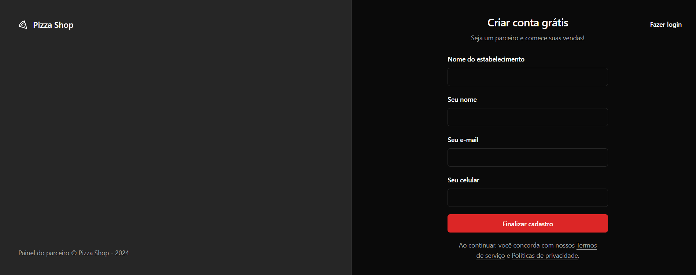

# Pizza Shop - Frontend

## Descrição

O PizzaShop é um aplicativo web que serve como um painel de controle completo para restaurantes, fornecendo uma visão abrangente de suas operações. Desenhado para demonstrar e praticar conceitos de React e comunicação com APIs, o projeto oferece um dashboard intuitivo com métricas cruciais para o negócio, como receita total, número de pedidos, produtos mais populares e muito mais.





## Tecnologias

* **React:** Cria interfaces de usuário interativas e componentes reutilizáveis.
* **react-router-dom:** Permite criar diferentes páginas e navegar entre elas.
* **react-hook-form:** Simplifica a criação e validação de formulários.
* **@hookform/resolvers:** Extensão do react-hook-form que fornece resolvers para diferentes esquemas de validação, como Zod.
* **zod:** Biblioteca de validação de dados TypeScript
* **shadcn/ui:** Fornece componentes pré-construídos para a interface do usuário.
* **react-query:** Facilita o gerenciamento de dados assíncronos.
* **tailwindcss:** Permite criar estilos personalizados de forma rápida e eficiente.
* **axios:** Realiza requisições HTTP para buscar dados de APIs.
* **date-fns:** Manipula datas e horários de forma fácil e intuitiva.
* **radix-ui:** Biblioteca de componentes UI de baixo nível, construída com base em princípios de acessibilidade e personalização.


## Como executar o projeto

1. **Clone o repositório:**
  ```bash
  git clone https://github.com/faelperini/04-pizza-shop-frontend
  ```

2. **Instale as dependências:**
  ```bash
  cd 04-pizza-shop-frontend
  npm install
  ```

3. **Inicie o desenvolvimento:**
  ```bash
  npm run dev
  ```

O aplicativo será iniciado em http://localhost:5173/

## Funcionalidades

* **Dashboard:**
  * **Visão geral do negócio:** Apresenta um resumo das métricas mais importantes do restaurante, como receita total, número de pedidos, produtos mais vendidos e outros indicadores chave de desempenho (KPIs).
  * **Gráficos e visualizações:** Utiliza gráficos e visualizações para apresentar os dados de forma clara e concisa, facilitando a análise e a tomada de decisões.
  * **Filtros e personalização:** Permite aos usuários filtrar os dados por data, produto ou outros critérios, permitindo uma análise mais detalhada.
* **Gerenciamento de pedidos:**
  * **Lista de pedidos:** Apresenta uma lista completa de todos os pedidos realizados, incluindo informações como data, cliente, itens pedidos, status do pedido e valor total.
  * **Detalhes do pedido:** Permite visualizar os detalhes de um pedido específico, incluindo os itens, preços e informações de entrega.
  * **Gerenciamento do status do pedido:** Permite aos usuários atualizar o status do pedido (por exemplo, em preparo, entregue, cancelado).
